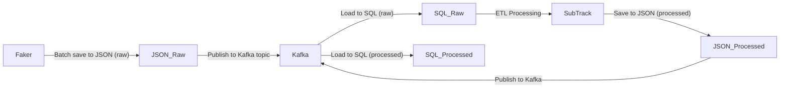

---

# 📊 Subscription Data Pipeline  

**A data engineering pipeline demonstrating batch-to-stream processing** using Python, SQL Server, Apache Kafka, and JSON intermediates. Generates synthetic subscription data, processes it through staged ETL, and delivers analytics-ready results.

---

## 🏗️ Architecture Overview  

  

### **Data Flow**  


### **Key Stages**  

1. **Generation & Raw JSON Stage**  
   - **Faker** generates synthetic data → persisted as **raw JSON files** (for validation/replay)  
   - **Kafka Producer** streams raw JSON records to `subscriptions_raw` topic  

2. **Raw Data Pipeline**  
   - **Kafka Consumer** ingests raw JSON into SQL Server (`raw_subscriptions`)  
   - **SubTrack** transforms data → outputs **processed JSON files**  

3. **Processed Data Pipeline**  
   - **Kafka Producer** streams processed JSON to downstream topics  
   - Final data lands in SQL Server (`processed_subscriptions`)  

---

## 🛠️ Technology Stack  

| Component           | Tools                                                                 |
|---------------------|-----------------------------------------------------------------------|
| **Data Generation** | Python Faker, JSON intermediates                                      |
| **Streaming**       | Apache Kafka (raw/processed topics)                                   |
| **Database**        | SQL Server (`raw_subscriptions`, `processed_subscriptions`)           |
| **Processing**      | Pandas (ETL), SQLAlchemy (ORM)                                       |
| **Connectivity**    | PyODBC (SQL Server), confluent-kafka (Python client)                 |

---

## 🚀 Quick Start  

### **1. Setup**  
```bash
git clone <repo-url> && cd subscription-pipeline
python -m venv venv && source venv/bin/activate  # or .\venv\Scripts\activate
pip install -r requirements.txt
```

### **2. Configure**  
- **SQL Server**: Update `database/config.py`  
- **Kafka**: Modify topics in `kafka/config.py`  

### **3. Run Pipeline**  
```bash
# Terminal 1: Generate data → raw JSON
python data_generation/faker_generator.py  

# Terminal 2: Stream raw JSON to Kafka
python kafka/raw_producer.py  

# Terminal 3: Process data → publish processed JSON
python processing/transformer.py  

# Terminal 4: Load processed JSON to DB
python kafka/processed_consumer.py  
```

---

## 📁 Project Structure  

```
subscription_pipeline/
├── data/
│   ├── raw/                  # Raw JSON from Faker
│   └── processed/            # Transformed JSON
├── data_generation/
│   └── faker_generator.py    # Generates → data/raw/*.json
├── kafka/
│   ├── raw_producer.py       # Streams raw JSON → Kafka
│   └── processed_consumer.py # Loads processed JSON → DB
└── processing/
    └── transformer.py        # SQL → Transform → data/processed/
```

---

## 🔄 JSON Integration Points  

1. **Raw Data Persistence**  
   - Faker outputs to `data/raw/subscriptions_<timestamp>.json`  
   - Optional: Replay JSON files for debugging by re-running producers  

2. **Processed Data Handoff**  
   - SubTrack saves cleansed data to `data/processed/subscriptions_<batch>.json`  
   - Kafka streams these files to final DB tables  

---

## 💡 Why JSON?  
- **Development**: Inspect/intermediate data without DB dependencies  
- **Testing**: Replay specific batches from JSON files  
- **Portability**: Decouple generation from streaming logic  

---

## 🐛 Troubleshooting  

**Issue** | **Solution**  
---|---
Kafka not streaming | Verify ZooKeeper/Kafka are running (`jps`)  
JSON files not found | Check `data/raw/` and `data/processed/` paths  
DB connection fails | Validate `pyodbc` connection string in `config.py`  

---

## 📜 License  
MIT © [Oussama Elalouaoui]  

