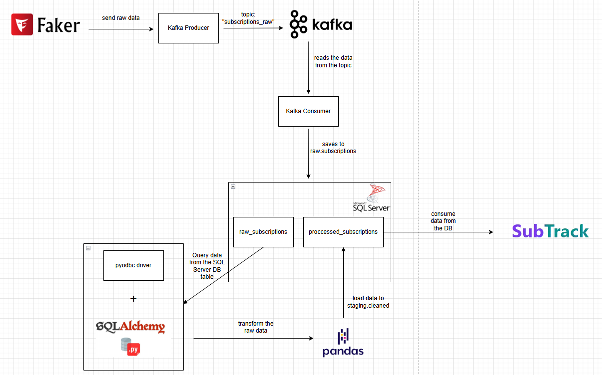
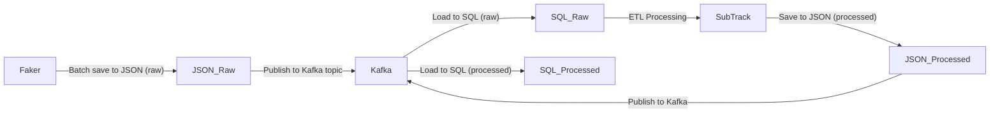

# 📊 Subscription Data Pipeline  

**A data engineering pipeline demonstrating batch-to-stream processing** using Python, SQL Server, Apache Kafka, and JSON intermediates. Generates synthetic subscription data, processes it through staged ETL, and delivers analytics-ready results.

## 🏗️ Architecture Overview  

  

### **Data Flow**  


### **Key Stages**  

1. **Generation & Raw JSON Stage**  
   - **Faker** generates synthetic data → persisted as **raw JSON files** (for validation/replay)  
   - **Kafka Producer** streams raw JSON records to `subscriptions_raw` topic  

2. **Raw Data Pipeline**  
   - **Kafka Consumer** ingests raw JSON into SQL Server (`raw_subscriptions`)  
   - **SubTrack** transforms data → outputs **processed JSON files**  

3. **Processed Data Pipeline**  
   - **Kafka Producer** streams processed JSON to downstream topics  
   - Final data lands in SQL Server (`processed_subscriptions`)  

## 🛠️ Technology Stack  

| Component           | Tools                                                                 |
|---------------------|-----------------------------------------------------------------------|
| **Data Generation** | Python Faker, JSON intermediates                                      |
| **Streaming**       | Apache Kafka (raw/processed topics)                                   |
| **Database**        | SQL Server (`raw_subscriptions`, `processed_subscriptions`)           |
| **Processing**      | Pandas (ETL)                                                          |
| **Connectivity**    | PyODBC (SQL Server), confluent-kafka (Python client), ODBC Driver    |

## 🚀 Quick Start  

### **1. Setup**  
```bash
git clone <repo-url> && cd subscription-pipeline
python -m venv .venv && source .venv/bin/activate  # or .\.venv\Scripts\activate
pip install -r requirements.txt
```

### **2. Configure**  
- **SQL Server**: 
  1. Install ODBC Driver for SQL Server from Microsoft's official website
  2. Update connection string in `database/config.py`:
     ```python
     connection_string = "DRIVER={ODBC Driver 17 for SQL Server};SERVER=your_server;DATABASE=your_db;UID=username;PWD=password"
     ```
- **Kafka**: Modify topics in `kafka/config.py`  

### **3. Run Pipeline**  
```bash
# Terminal 1: Generate data → raw JSON
python data_generation/faker_generator.py  

# Terminal 2: Stream raw JSON to Kafka
python kafka/producer_raw.py  

# Terminal 3: Load raw JSON to DB 
python kafka/consumer_raw.py

# Terminal 4: Process data → publish processed JSON
python processing/transformer.py  

# Terminal 5: Stream processed JSON to Kafka
python kafka/producer_processed.py 

# Terminal 6: Load processed JSON to DB
python kafka/consumer_processed.py  
```

Here's the updated project structure section of the README.md file that matches exactly what's shown in your screenshot:


## 📁 Project Structure  
```
subscription_pipeline/
├── .venv/                   # Python virtual environment
├── assets/
│   └── images/              # Architecture diagrams and visuals
├── data_generation/         # Synthetic data generation scripts
├── database/
│   ├── __init__.py
│   ├── config.py            # Database connection configuration
│   ├── db_utils.py          # Database utility functions
│   └── models.py            # Data models and schemas
├── kafka/
│   ├── __init__.py
│   ├── config.py            # Kafka brokers and topics configuration
│   ├── consumer_processed.py # Processed data consumer
│   ├── consumer_raw.py      # Raw data consumer
│   ├── producer_processed.py # Processed data producer
│   └── producer_raw.py      # Raw data producer
├── processing/
│   ├── __init__.py
│   ├── data_quality.py      # Data validation and quality checks
│   └── transformer.py       # ETL transformation logic
├── .gitignore
├── cleaned_data_output.json # Final processed data output
├── raw_data_output.json     # Raw generated data output
├── Raw_Subscription_Data_DB.sql # Database schema file
└── README.md
```
## 🐛 Troubleshooting  

**Issue** | **Solution**  
---|---
Kafka not streaming | Verify ZooKeeper/Kafka are running (`jps`)  
JSON files not found | Check root directory for raw_data_output.json and cleaned_data_output.json  
DB connection fails | 1. Verify ODBC driver is installed<br>2. Validate connection string in `config.py`<br>3. Check SQL Server authentication  
ODBC Driver missing | Download from Microsoft: https://learn.microsoft.com/en-us/sql/connect/odbc/download-odbc-driver-for-sql-server  

---

## 📜 License  
MIT © [Oussama Elalouaoui]  
